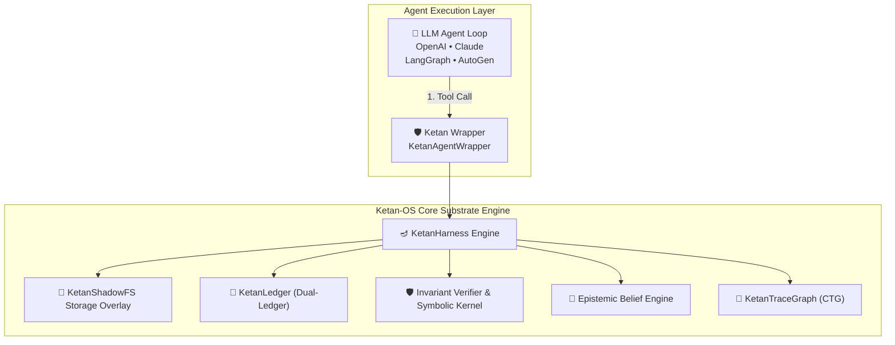

# Contributing to Ketan-OS 🪔 (केतन)

Thank you for your interest in contributing to **Ketan-OS**! Ketan is an open-source, framework-agnostic execution substrate that brings transactional snapshotting, live causal failure tracing, pre-flight assertion verification, epistemic belief memory pruning, symbolic invariant micro-patching, and sub-second time-travel rollback to AI agents.

---

## 🏗️ Architecture Overview



### Key Modules in `ketan/`:
1. **`ketan/core.py` (`KetanHarness`)**: Central thread-safe coordinator engine.
2. **`ketan/shadow_fs.py` (`KetanShadowFS`)**: Transactional incremental snapshotting with LRU eviction.
3. **`ketan/dual_ledger.py` (`KetanLedger`)**: Synchronizes environment file state and prompt history.
4. **`ketan/verifier.py` (`InvariantVerifier`)**: Pre-flight AST syntax check and safety guards.
5. **`ketan/epistemic.py` (`EpistemicBeliefEngine`)**: Tracks belief statements and auto-prunes memory contradictions.
6. **`ketan/symbolic_kernel.py` (`SymbolicInvariantKernel`)**: eBPF-style sub-millisecond rule check & micro-patching.
7. **`ketan/speculative_kernel.py` (`PredictiveSpeculativeKernel`)**: Predictive task-level speculative parallel execution.
8. **`ketan/causal_graph.py` (`KetanTraceGraph`)**: Live causal execution DAG lineage.
9. **`ketan/policy.py` (`PolicyEngine`)**: Scope-locked RBAC permissions & path matching.
10. **`ketan/jit_compiler.py` (`JITCompiler`)**: Skill compilation for zero-token execution.
11. **`ketan/persona.py` (`PersonaManager`)**: State freezing, forking, and diffing.
12. **`ketan/adapters/`**: Framework adapters (LangGraph, generic tool wrappers).

---

## 🛠️ Local Development Setup

```bash
git clone https://github.com/umang-algo/ketan-os.git
cd ketan-os

# Run tests
uv run python -m unittest discover tests
```

---

## 📜 Pull Request Guidelines

1. **Keep Tests Passing**: Run `uv run python -m unittest discover tests` before submitting PRs.
2. **Backward Compatibility**: Ensure public APIs (`KetanHarness`, `ShadowFS`, `KetanLedger`) remain compatible.
