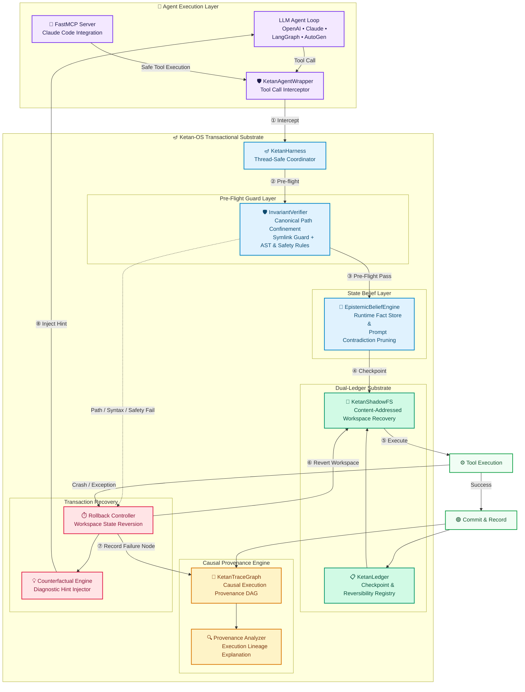

# Ketan-OS 🪔 (केतन)
### The Transactional Runtime for AI Agents

[](https://opensource.org/licenses/MIT)
[](https://www.python.org/)
[](tests/)
[](ketan/mcp/server.py)
[](https://glama.ai/mcp/servers/umang-algo/ketan-os)
[](https://m8ven.ai/mcp/umang-algo-ketan-os-1k4rg0)

---

## 🔱 Origin & Philosophy

> *"Aham ātmā guḍākeśa sarva-bhūtāśaya-sthitaḥ"*  
> — **Bhagavad Gita, Chapter 10, Verse 20**  
>  
> *"I am the Self, O Gudakesha, seated in the hearts of all beings.  
> I am the beginning, the middle, and the end of all beings."*  

**Ketan (केतन)** literally means *Banner, Beacon, or Dwelling* in Sanskrit — the fixed, unmovable point of reference from which all navigation begins.

AI agents perform complex, multi-step actions across files, commands, and external tools — but they lack **transaction semantics**. When an agent writes a malformed file, executes a destructive shell command, or acts on stale assumptions, standard agent frameworks have no rollback mechanism.

**Ketan-OS provides the transactional substrate for AI agents**:
```text
BEGIN  →  CHECKPOINT  →  VERIFY  →  COMMIT / ROLLBACK / COMPENSATE
```

By wrapping tool execution in content-addressed state snapshotting, canonical path isolation, pre-flight assertion guards, causal execution provenance, and prompt contradiction pruning, Ketan-OS makes agent tool execution safe, reversible, and debuggable.

---

## 🌟 4 Core Architectural Subsystems

| Subsystem | Component | What Ketan-OS Does |
|:---|:---|:---|
| **1. Transactional Workspace Recovery** | `KetanShadowFS` | Takes incremental, content-addressed workspace snapshots using SHA-256 blob deduplication (`blobs/<sha256>`). Reverts tracked regular workspace files to clean checkpoints. |
| **2. Multi-Layer Pre-Flight Guards** | `InvariantVerifier` | Enforces strict workspace canonical path isolation (`is_relative_to(workspace_root)`), blocks symlink traversal escapes, checks Python AST syntax, and filters destructive shell patterns. |
| **3. Causal Execution Provenance DAG** | `KetanTraceGraph` | Records tool calls, checkpoints, failures, and rollbacks into a directed acyclic graph (DAG). On failure, automatically traverses the DAG backwards to explain the execution lineage. |
| **4. State Belief & Fact Store** | `EpistemicBeliefEngine` | Tracks factual assertions about workspace state. Uses type coercion (`_values_are_equivalent`) to prevent false positives and auto-prunes contradicted prompt assumptions. |

---

## 🛡️ Side-Effect Reversibility Matrix

Ketan-OS tracks tool operations across three distinct transaction recovery tiers:

| System / Target | Reversibility Tier | Recovery Strategy |
|:---|:---:|:---|
| **Local Workspace Files** | `REVERSIBLE` | Automatic content-addressed state rollback via `KetanShadowFS` |
| **Git Repositories** | `REVERSIBLE` | Automated workspace restore / branch checkpoint reversion |
| **PostgreSQL / SQL Databases** | `COMPENSATABLE` | Inverse transaction query or registered compensation handler |
| **S3 / Blob Storage** | `COMPENSATABLE` | Object versioning rollback or compensation handler |
| **GitHub / AWS / Infrastructure** | `COMPENSATABLE` | Registered API inverse call (e.g. close issue, delete resource) |
| **External Network APIs / Email** | `IRREVERSIBLE` | Pre-execution policy check & counterfactual failure hint |

---


## 🏗️ System Architecture



---

## ⚡ Quickstart

```python
from ketan import KetanHarness, KetanAgentWrapper

# 1. Initialize Ketan-OS for your project workspace
harness = KetanHarness(workspace_dir="./my_project")
wrapper = KetanAgentWrapper(harness)

# 2. Wrap any tool with transactional protection
def write_code(args):
    with open(args["filepath"], "w") as f:
        f.write(args["content"])
    return "File written"

safe_write = wrapper.wrap_tool("write_file", write_code)

# 3. Execute — Ketan-OS handles snapshot, pre-flight, rollback automatically
result = safe_write(
    tool_args={"filepath": "main.py", "content": "def run():\n    return 42\n"},
    prompt_stack=[{"role": "user", "content": "Create main function"}]
)
print(result)
# → {"success": True, "result": "File written", "hint": ""}
# If content had a syntax error → {"success": False, "hint": "Fix SyntaxError on line 1..."}
# → workspace auto-rolled back cleanly
```

---

## 🔌 Claude Code FastMCP Integration

Ketan-OS ships a ready-to-use **FastMCP server** that gives Claude Code native tools for safe, transactional, auditable agentic coding.

### 1. Install

```bash
git clone https://github.com/umang-algo/ketan-os.git
cd ketan-os
uv pip install -e .
```

### 2. Configure Claude Code

Add to `~/.claude/claude.json`:

```json
{
  "mcpServers": {
    "ketan-os": {
      "command": "python",
      "args": ["-m", "ketan.mcp.server", "--workspace", "/absolute/path/to/your/project"]
    }
  }
}
```

---

## 🧪 Running Tests & Benchmarks

```bash
# Run unit test suite
uv run pytest tests/

# Run performance benchmark suite
uv run python examples/benchmark_ketan_performance.py
```

---

## 📜 License

MIT License. Copyright (c) 2026 umang-algo.
