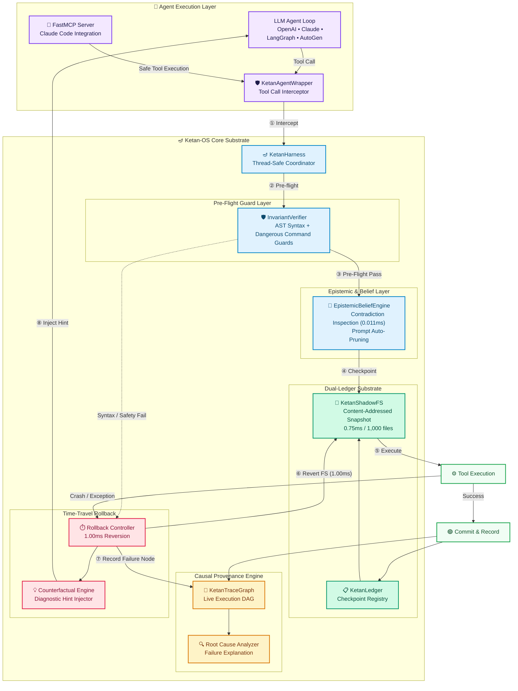

# Ketan-OS 🪔 (केतन)
### The Transactional Intelligence Substrate & Beacon of Ground Truth for AI Agents

[](https://opensource.org/licenses/MIT)
[](https://www.python.org/)
[](tests/)
[](ketan/mcp/server.py)

---

## 🔱 Origin & Philosophy

> *"Aham ātmā guḍākeśa sarva-bhūtāśaya-sthitaḥ"*  
> — **Bhagavad Gita, Chapter 10, Verse 20**  
>  
> *"I am the Self, O Gudakesha, seated in the hearts of all beings.  
> I am the beginning, the middle, and the end of all beings."*  

**Ketan (केतन)** literally means *Banner, Beacon, or Dwelling* in Sanskrit — the fixed, unmovable point of reference from which all navigation begins. In the context of AI agents, Ketan-OS is that **beacon of ground truth**: the substrate that ensures an agent's environment, memory, and decisions are always anchored to verifiable, uncorrupted reality.

Modern AI agent frameworks (LangGraph, AutoGen, CrewAI, Claude Code) are powerful orchestration layers — but they are blind to **what is actually happening on disk and in memory**. When an agent writes a malformed file, executes a destructive command, or hallucinates a state that no longer exists, these frameworks have no recovery mechanism. The environment corrupts silently and irrecoverably.

**Ketan-OS solves this at the substrate level** — not by competing with agent frameworks, but by serving as an effortless plug-and-play transactional layer beneath them. Wrapping tool calls in atomic snapshot/rollback, multi-layer pre-flight guards, live causal tracing, and epistemic contradiction pruning, Ketan-OS makes agent tool execution safe, reversible, and debuggable.

---

## 🌟 4 Core Substrate Pillars

| Core Pillar | Component | Performance | What Ketan-OS Does |
|:---|:---|:---:|:---|
| **1. Sub-Second Transactional ShadowFS** | `KetanShadowFS` | **0.75 ms** (1k files) | Takes incremental, content-addressed snapshots of the workspace using SHA-256 blob deduplication (`blobs/<sha256>`). Stores unique file contents once. |
| **2. Atomic Time-Travel Rollback** | `KetanHarness` & `KetanLedger` | **1.00 ms** rollback | On any crash, exception, syntax error, or assertion failure, the workspace is reverted byte-for-byte to the last clean checkpoint. Zero state leaks across 100+ crashes. |
| **3. Multi-Layer Pre-Flight Guards** | `InvariantVerifier` | Sub-millisecond | Evaluates Python AST syntax before file writes hit disk and inspects shell commands for destructive patterns (`rm -rf /`, `rm -rf $HOME`, device wipes, fork bombs, obfuscated pipes). |
| **4. Live Causal Execution Trace Graph** | `KetanTraceGraph` | Live DAG Lineage | Records every tool call, checkpoint, failure, and rollback into a directed acyclic graph (DAG). On failure, automatically traverses the DAG backwards to explain the root cause. |
| **Epistemic Belief Engine** | `EpistemicBeliefEngine` | **0.011 ms** inspection | Tracks factual beliefs about workspace state. Uses type coercion (`_values_are_equivalent`) to prevent false positives and auto-prunes contradicted prompt assumptions. |

---

## 🏗️ System Architecture



---

## ⚡ Quickstart

```python
from ketan import KetanHarness, KetanAgentWrapper

# 1. Initialize Ketan-OS for your project workspace
harness = KetanHarness(workspace_dir="./my_project")
wrapper = KetanAgentWrapper(harness)

# 2. Wrap any tool with transactional protection
def write_code(args):
    with open(args["filepath"], "w") as f:
        f.write(args["content"])
    return "File written"

safe_write = wrapper.wrap_tool("write_file", write_code)

# 3. Execute — Ketan-OS handles snapshot, pre-flight, rollback automatically
result = safe_write(
    tool_args={"filepath": "main.py", "content": "def run():\n    return 42\n"},
    prompt_stack=[{"role": "user", "content": "Create main function"}]
)
print(result)
# → {"success": True, "result": "File written", "hint": ""}
# If content had a syntax error → {"success": False, "hint": "Fix SyntaxError on line 1..."}
# → workspace auto-rolled back, not a single byte changed on disk
```

---

## 🔌 Claude Code FastMCP Integration

Ketan-OS ships a ready-to-use **FastMCP server** that gives Claude Code native tools for safe, transactional, auditable agentic coding.

### 1. Install

```bash
git clone https://github.com/umang-algo/ketan-os.git
cd ketan-os
uv pip install -e .
```

### 2. Configure Claude Code

Add to `~/.claude/claude.json`:

```json
{
  "mcpServers": {
    "ketan-os": {
      "command": "python",
      "args": ["-m", "ketan.mcp.server", "--workspace", "/absolute/path/to/your/project"]
    }
  }
}
```

### 3. Available MCP Tools

| Tool | What it does |
|---|---|
| `ketan_get_status` | Ground-truth state: steps, checkpoints, failures |
| `ketan_snapshot` | Take atomic workspace snapshot → get rollback point |
| `ketan_rollback` | Time-travel revert to any checkpoint |
| `ketan_get_checkpoints` | List all restore points |
| `ketan_write_file_safe` | Write file with pre-flight AST guards + auto rollback |
| `ketan_run_bash_safe` | Run shell command with snapshot + auto rollback |
| `ketan_check_invariant` | Dry-run invariant check (no execution) |
| `ketan_get_ctg` | Causal Trace Graph as Mermaid diagram |
| `ketan_explain_failure` | Root cause explanation of the last failure |
| `ketan_observe_belief` | Record a workspace fact into Epistemic Engine |
| `ketan_list_beliefs` | See all tracked beliefs |
| `ketan_read_file` | Read file + record as belief |
| `ketan_list_files` | Browse workspace files |
| `ketan_session_summary` | Full markdown session report |
| `ketan_init_workspace` | Switch to a different workspace |

---

## 🧩 Module Map

| Module | Class | What It Does |
|---|---|---|
| `ketan/core.py` | `KetanHarness` | Central thread-safe coordinator engine |
| `ketan/shadow_fs.py` | `KetanShadowFS` | Incremental workspace snapshotting & rollback (0.75ms / 1k files) |
| `ketan/dual_ledger.py` | `KetanLedger` | Checkpoint registry synchronizing FS + prompt state |
| `ketan/verifier.py` | `InvariantVerifier` | Pre-flight AST syntax & dangerous bash command guards |
| `ketan/causal_graph.py` | `KetanTraceGraph` | Live execution DAG + root cause failure explanation |
| `ketan/epistemic.py` | `EpistemicBeliefEngine` | Belief tracking, contradiction detection, prompt pruning |
| `ketan/adapters/` | `KetanAgentWrapper` | LangGraph + generic LLM adapter middleware |
| `ketan/mcp/server.py` | FastMCP Server | Safe, transactional MCP tools via stdio transport |

---

## 🧪 Running Tests & Benchmarks

```bash
# Run unit test suite
uv run pytest tests/
# → 19 passed in 0.44s

# Run empirical benchmark suite
uv run python examples/benchmark_ketan_performance.py
# → 1,000 Files Snapshot Latency: 0.74 ms
# → Time-Travel Rollback Latency: 0.95 ms
# → Data Integrity & Zero State Leak: 100% VERIFIED
```

---

## 📜 License

MIT License. Copyright (c) 2026 umang-algo.
