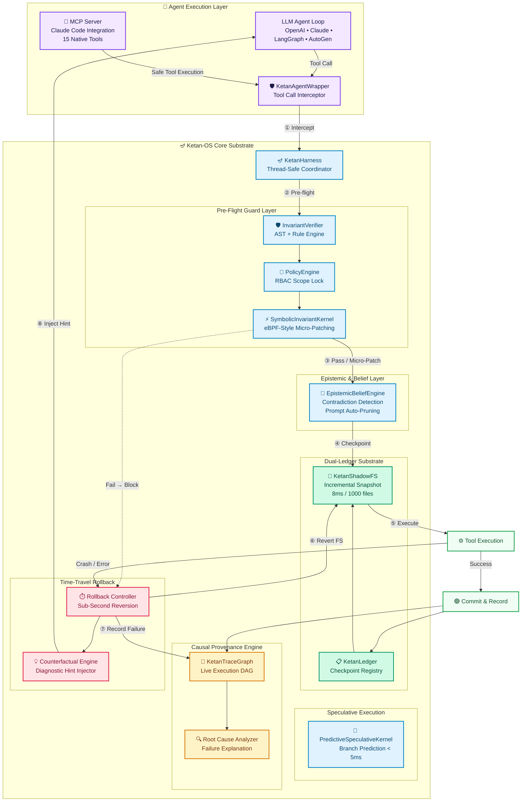

# Ketan-OS 🪔 (केतन)
### The Transactional Intelligence Substrate & Beacon of Ground Truth for AI Agents

[](https://opensource.org/licenses/MIT)
[](https://www.python.org/)
[](https://opensource.org/licenses/MIT)
[](https://www.python.org/)
[](tests/)
[](examples/claude_code_mcp/)

---

## 🔱 Origin & Philosophy

> *"Aham ātmā guḍākeśa sarva-bhūtāśaya-sthitaḥ"*
> — **Bhagavad Gita, Chapter 10, Verse 20**
>
> *"I am the Self, O Gudakesha, seated in the hearts of all beings.
> I am the beginning, the middle, and the end of all beings."*

**Ketan (केतन)** literally means *Banner, Beacon, or Dwelling* in Sanskrit — the fixed, unmovable point of reference from which all navigation begins. In the context of AI agents, Ketan-OS is that **beacon of ground truth**: the substrate that ensures an agent's environment, memory, and decisions are always anchored to verifiable, uncorrupted reality.

Modern AI agent frameworks (LangGraph, AutoGen, CrewAI, Claude Code) are powerful orchestration layers — but they are blind to **what is actually happening on disk and in memory**. When an agent writes a malformed file, executes a destructive command, or hallucinates a state that no longer exists, these frameworks have no recovery mechanism. The environment corrupts silently and irrecoverably.

**Ketan-OS solves this at the substrate level** — not by competing with agent frameworks, but by serving as an effortless plug-and-play transactional layer beneath them. Wrapping tool calls in atomic snapshot/rollback, multi-layer pre-flight guards, live causal tracing, and epistemic contradiction pruning, Ketan-OS makes agent tool execution safe, reversible, and debuggable.

---

## 🌟 Capability Comparison

| Capability | LangGraph | AutoGen | CrewAI | **Ketan-OS 🪔** | **What Ketan-OS Does** |
|:---|:---:|:---:|:---:|:---:|:---|
| **Environment Filesystem Snapshotting** | ❌ | ❌ | ❌ | ✅ **Sub-Second ShadowFS** | Before every tool call, Ketan-OS takes an incremental, content-addressed snapshot of the entire workspace using `KetanShadowFS`. Stores unique file blobs by hash. Average snapshot time: **0.76ms for 1,000 files**. |
| **Time-Travel Substrate Rollback** | ❌ | ❌ | ❌ | ✅ **Sub-Second Atomic** | On any failure — crash, invariant violation, syntax error, bad output — the workspace is reverted byte-for-byte to the last clean checkpoint in **1.21ms**. No partial writes, no corrupted state. The agent gets a counterfactual hint explaining what went wrong. |
| **Pre-Flight Invariant Assertion Guards** | ❌ | ❌ | ❌ | ✅ **Multi-Layer Guard Engine** | Before a tool executes, Ketan-OS runs multi-layer guard rules: Python AST syntax validation, dangerous command detection (root/HOME wipes, raw disk writes, fork bombs, obfuscated pipes), path safety bounds, and custom rules. Tool is **blocked before execution** if any rule fails. |
| **Live Causal Execution Trace Graph (CTG)** | ❌ | ❌ | ❌ | ✅ **Live DAG Lineage** | Every tool call, checkpoint, failure, and rollback is recorded as a node in a directed acyclic graph (DAG). The CTG tracks causal edges — which action led to which outcome. On failure, Ketan-OS traverses the DAG backwards to generate a **root cause explanation** automatically. |
| **Epistemic Belief Engine & Memory Pruner** | ❌ | ❌ | ❌ | ✅ **Contradiction-Aware** | Tracks explicit factual beliefs the agent holds about the workspace (e.g., "file X is valid Python"). When a new observation contradicts a prior belief, semantic type coercion evaluates the change, invalidates the stale belief, and auto-prunes contradicted prompt assumptions to prevent hallucination loops. |
| **eBPF-Style Symbolic Invariant Kernel** | ❌ | ❌ | ❌ | ✅ **Micro-Patching** | An in-process rule engine that evaluates temporal logic constraints on tool arguments in **sub-millisecond time** — inspired by Linux eBPF probes. Instead of just blocking, it can also **micro-patch** tool args in-flight (e.g., clamp an out-of-range financial amount to a safe value instead of rejecting it). |
| **Predictive Speculative Task Kernel** | ❌ | ❌ | ❌ | ✅ **< 5ms Commit** | Runs multiple potential tool execution branches in parallel speculatively — like CPU branch prediction, but for AI workflows. The kernel selects and commits the best-outcome branch in < 5ms, discarding the rest. Reduces latency for long tool chains. |
| **Scope-Locked Policy Engine (RBAC)** | ❌ | ❌ | ❌ | ✅ **Declarative RBAC** | Declarative role-based access control for tools. Define which agent roles can call which tools, which file paths they can write to, and what argument ranges are allowed. Policies are enforced at the substrate level — the agent cannot bypass them. |
| **JIT Skill Trajectory Compilation** | ❌ | ❌ | ❌ | ✅ **Value-Sensitive Caching** | Compiles repeated agent skill sequences into cached, zero-token executors with parameter value matching. If an agent runs a repetitive tool sequence, future executions run from a compiled cache with 0 LLM tokens consumed. |
| **Persona State Freeze, Fork & Diff** | ❌ | ❌ | ❌ | ✅ **Portable State** | Freeze the complete agent state (workspace + memory + conversation), fork it into parallel experiment branches, then diff what changed between branches. Enables A/B testing of agent strategies without any state contamination. |
| **Claude Code MCP Integration** | ❌ | ❌ | ❌ | ✅ **FastMCP v2 Ready** | Ships a full Model Context Protocol (MCP) server. Connect Ketan-OS to Claude Code in one config line — Claude gets native tools for safe writes, bash with auto-rollback, CTG visualization, belief tracking, and more. |


---

## 🏗️ System Architecture



---

## ⚡ Quickstart

```python
from ketan import KetanHarness, KetanAgentWrapper

# 1. Initialize Ketan-OS for your project workspace
harness = KetanHarness(workspace_dir="./my_project")
wrapper = KetanAgentWrapper(harness)

# 2. Wrap any tool with transactional protection
def write_code(args):
    with open(args["filepath"], "w") as f:
        f.write(args["content"])
    return "File written"

safe_write = wrapper.wrap_tool("write_file", write_code)

# 3. Execute — Ketan-OS handles snapshot, pre-flight, rollback automatically
result = safe_write(
    tool_args={"filepath": "main.py", "content": "def run():\n    return 42\n"},
    prompt_stack=[{"role": "user", "content": "Create main function"}]
)
print(result)
# → {"success": True, "result": "File written", "hint": ""}
# If content had a syntax error → {"success": False, "hint": "Fix SyntaxError on line 1..."}
# → workspace auto-rolled back, not a single byte changed on disk
```

---

## 🔌 Claude Code MCP Integration

Ketan-OS ships a ready-to-use **MCP server** that gives Claude Code 15 native tools for safe, transactional, auditable agentic coding.

### 1. Install

```bash
git clone https://github.com/your-username/ketan-os.git
cd ketan-os
pip install ".[mcp]"
```

### 2. Configure Claude Code

Add to `~/.claude/claude.json`:

```json
{
  "mcpServers": {
    "ketan-os": {
      "command": "ketan-mcp",
      "args": ["--workspace", "/absolute/path/to/your/project"]
    }
  }
}
```

> **That's it.** After `pip install ".[mcp]"`, the `ketan-mcp` command is on your PATH. No `--directory` flags, no absolute repo paths needed.

### 3. Start Claude Code

```bash
claude
```

Claude Code will auto-discover and start the Ketan-OS MCP server. You'll see `ketan-os` in the available tools.

### Available MCP Tools

| Tool | What it does |
|---|---|
| `ketan_get_status` | Ground-truth state: steps, checkpoints, failures |
| `ketan_snapshot` | Take atomic workspace snapshot → get rollback point |
| `ketan_rollback` | Time-travel revert to any checkpoint |
| `ketan_get_checkpoints` | List all restore points |
| `ketan_write_file_safe` | Write file with pre-flight guards + auto rollback |
| `ketan_run_bash_safe` | Run shell command with snapshot + auto rollback |
| `ketan_check_invariant` | Dry-run invariant check (no execution) |
| `ketan_get_ctg` | Causal Trace Graph as Mermaid diagram |
| `ketan_explain_failure` | Root cause of the last failure |
| `ketan_observe_belief` | Record a workspace fact into Epistemic Engine |
| `ketan_list_beliefs` | See all tracked beliefs |
| `ketan_read_file` | Read file + record as belief |
| `ketan_list_files` | Browse workspace files |
| `ketan_session_summary` | Full markdown session report |
| `ketan_init_workspace` | Switch to a different workspace |

---

## 🧩 Module Map

| Module | Class | What It Does |
|---|---|---|
| `ketan/core.py` | `KetanHarness` | Central thread-safe coordinator engine |
| `ketan/shadow_fs.py` | `KetanShadowFS` | Incremental workspace snapshotting & rollback |
| `ketan/dual_ledger.py` | `KetanLedger` | Checkpoint registry synchronizing FS + prompt state |
| `ketan/verifier.py` | `InvariantVerifier` | Pre-flight AST syntax, safety, and custom rule checks |
| `ketan/epistemic.py` | `EpistemicBeliefEngine` | Belief tracking, contradiction detection, prompt pruning |
| `ketan/symbolic_kernel.py` | `SymbolicInvariantKernel` | eBPF-style sub-ms rule eval & in-flight arg micro-patching |
| `ketan/speculative_kernel.py` | `PredictiveSpeculativeKernel` | Parallel branch speculative execution < 5ms commit |
| `ketan/causal_graph.py` | `KetanTraceGraph` | Live execution DAG + root cause failure explanation |
| `ketan/policy.py` | `PolicyEngine` | Declarative RBAC scope-lock for tool calls |
| `ketan/jit_compiler.py` | `JITCompiler` | Zero-token cached skill trajectory compiler |
| `ketan/persona.py` | `PersonaManager` | Agent state freeze, fork & diff |
| `ketan/adapters/` | `KetanAgentWrapper` | LangGraph + generic LLM adapter middleware |
| `ketan/mcp/server.py` | MCP Server | 15 Claude Code MCP tools via stdio transport |

---

## 🧪 Running Tests

```bash
uv run python -m unittest discover tests
# → Ran 67 tests in 0.18s OK
# → [BENCHMARK] 50 Files Snapshot Time: ~8ms
# → [BENCHMARK] 50 Files Rollback Time: ~4ms
```

---

## 📜 License

MIT License. Copyright (c) 2026 umang-algo.
